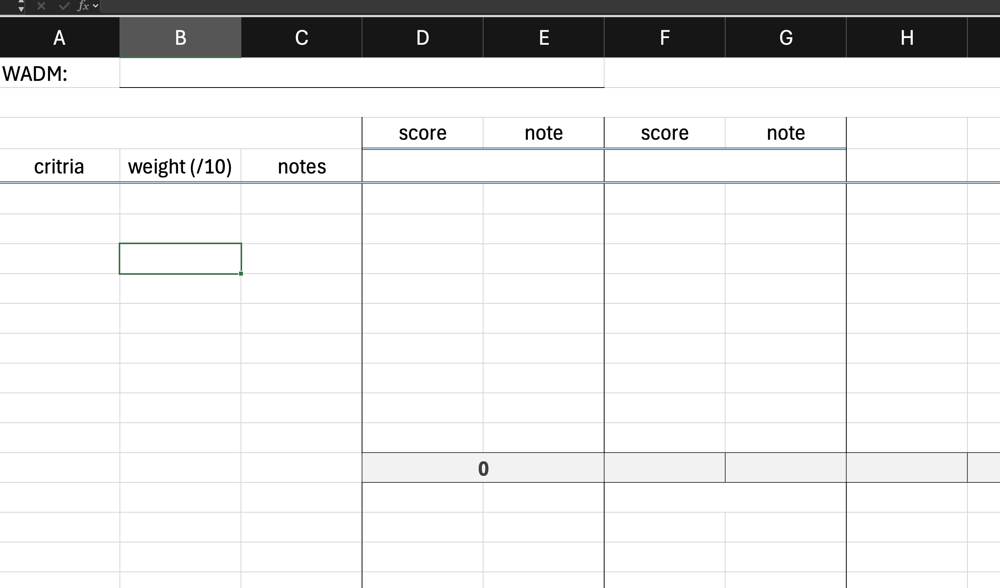
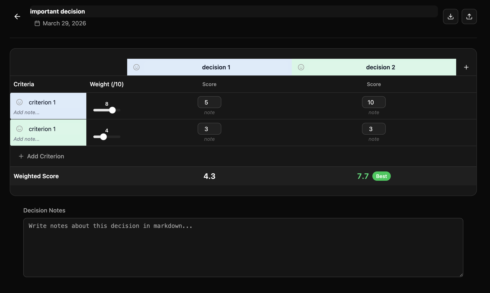

# WADM - Weighted Average Decision Matrix

https://usewadm.vercel.app/

---

A macOS desktop app for structured decision-making. Define your options, set weighted criteria, score each option, and let the math guide your choice.

<p align="center">
  
  <span>&nbsp;&nbsp;&rarr;&nbsp;&nbsp;</span>
  
</p>

## How It Works

1. **Create a decision** - give it a name, date, and optional notes
2. **Define criteria** - what matters to you (e.g. cost, quality, location) with a weight from 1-10
3. **Add options** - the choices you're evaluating
4. **Score each option** - rate every option against each criterion (1-10, with 0.5 increments)
5. **Compare weighted totals** - the app calculates `score x weight` across all criteria for each option

Each criterion and option can have a custom icon (Lucide icons) and color for visual clarity. Notes can be attached at every level - the decision itself, each criterion, and each individual score.

## Tech Stack

- **Runtime**: [Bun](https://bun.sh)
- **Desktop**: [ElectroBun](https://electrobun.dev) (native macOS wrapper)
- **Frontend**: React 19, TypeScript, Tailwind CSS, [shadcn/ui](https://ui.shadcn.com)
- **Storage**: Local JSON files synced via iCloud (`~/Library/Mobile Documents/com~apple~CloudDocs/wadm/storage/`)

No database. No external APIs. Each decision is a human-readable `.json` file named by date and title (e.g. `2025-12-02-what-car-should-i-buy.json`).

## Prerequisites

- macOS (arm64)
- [Bun](https://bun.sh) v1.1+

## Getting Started

```bash
# Install dependencies
bun install

# Run in browser (dev mode with HMR)
bun dev

# Run as desktop app
bun run desktop

# Run desktop app with file watching
bun run desktop:watch
```

## Building

```bash
# Build the macOS .app and install to /Applications
bun run desktop:build
```

This produces a `WADM.app` bundle and copies it to your Applications folder.

## Project Structure

```
src/
  index.ts          # Web server entry point (Bun.serve)
  index.html        # HTML shell
  frontend.tsx      # React root
  App.tsx           # Main app (list/editor routing)
  api.ts            # Frontend API client
  types.ts          # TypeScript interfaces
  bun/
    index.ts        # ElectroBun desktop entry point
  components/
    WadmList.tsx    # Decision list view
    WadmEditor.tsx  # Decision matrix editor
    IconPicker.tsx  # Icon & color picker
    ConfirmDelete.tsx
    HoverTrash.tsx
    ui/             # shadcn/ui primitives
  hooks/
    useRoute.ts     # Hash-based routing
scripts/
  copy-dist.ts      # Post-build: copy frontend into .app bundle
  install-app.ts    # Copy built .app to /Applications
spec/
  spec.md           # Feature specification
  UI-and-behviour-spec.md  # UI design spec
```

## License

GPL
